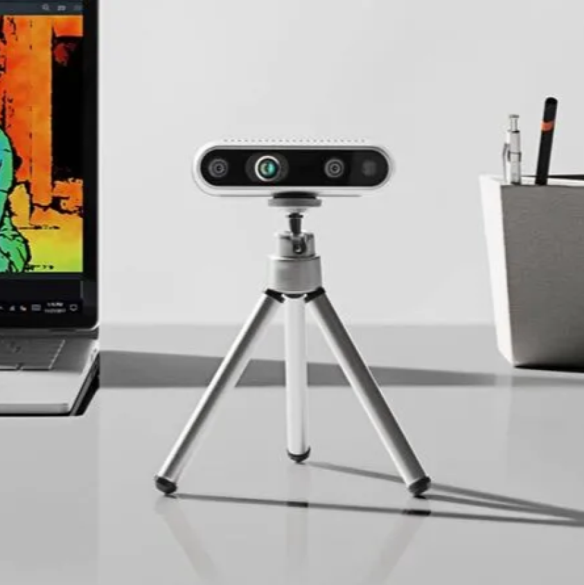
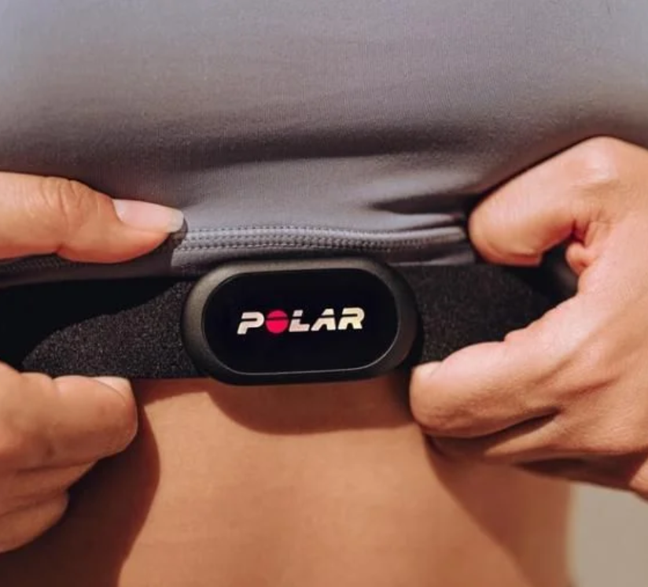
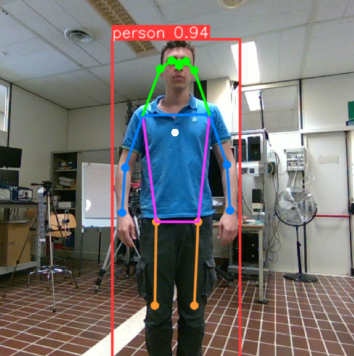
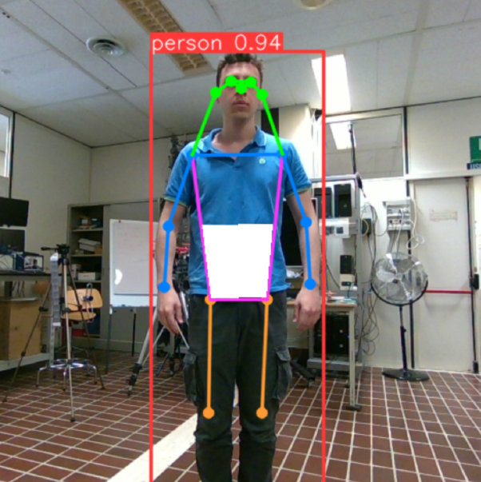
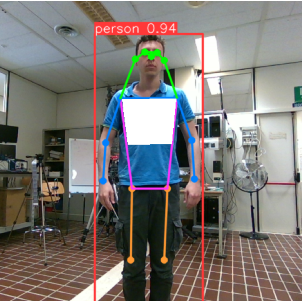
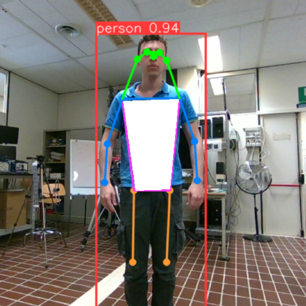
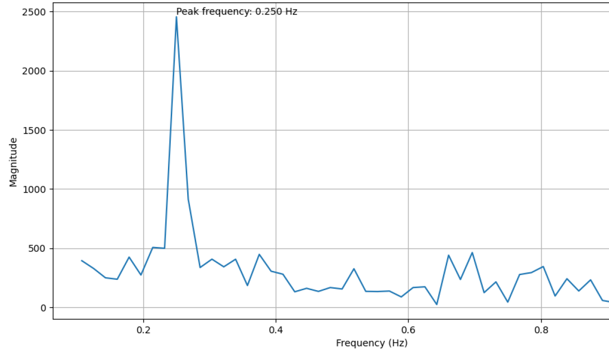
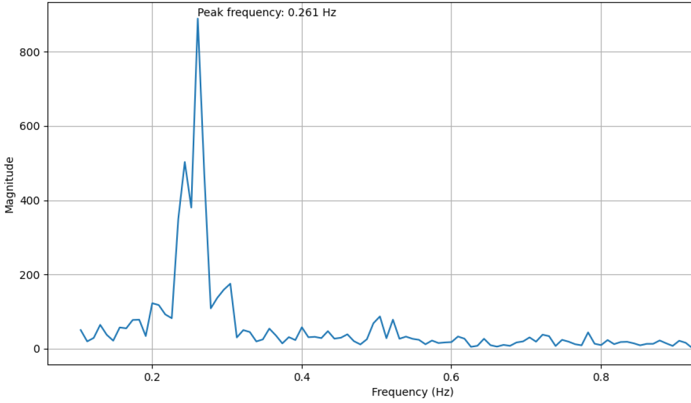

# Respiration signal extraction using a RealSense Camera

This is the project I brought for my thesis presentation at the end of my last year of my bachelor degree in computer science. For the creation of this project I collaborated with two of my collegues: Christian Chiappa and Matteo Stronati.

**MAIN GOAL**

The purpose of this project was to exctract the respiration signal using a camera without relying on any physical sensor applied over the skin of the person.

**ITEMS USED**

The project was conducted with the application of a camera Intel RealSense 450 and a Polar H10. The camera extracts the signal and it provides the result, whereas the polar H10 is used only for compare the result with the actual respiration rate.

**ALGORITHM**

3 main steps:
- **Acquisition**: We will record the person breathing for a certain period of time. During the recording both the camera and the polar sensor are getting data. The RealSense camera is able to get the RGB signal and the distance signal for each pixel, so at the end we will have multiple frames, where each pixel is represented by 4 values (R, G, B, D). At the end of the recording the data are saved in a npy file.
- **Post processing**: Each frame is post processed in order to extract the value of the distance from the camera of a certain area of the body.
- **Plotting data**: At the end we can plot both the respiration signal extracted by the camera and the actual respiration signal captured from the polar.

**DIFFERENT EXTRACTIONS**

For the extractions we use the *yolo8n-pose* model that is able to recognize a person given a frame. From that we where able to extract the signal based on 4 different areas (center-dot, down-abdomen, up-updomen, full-abdomen). At the end we will plot 4 distances captured in different ways based on these areas.

    
    

    
    

**FINAL PLOT**

These are 2 plots, the first one is the distance captured by the camera of one of the algorithm, and the second one is the actual signal resulted from the polar sensor. Using some transformations we were able to compute each signal in order to exctract the frequency and make an easier comparison. As we can see the frequency exctracted is pretty accurate because close enough to the frequency in the second graph, which is the polar one.

